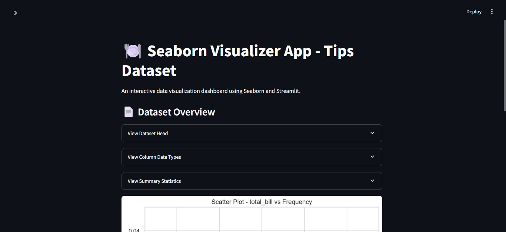
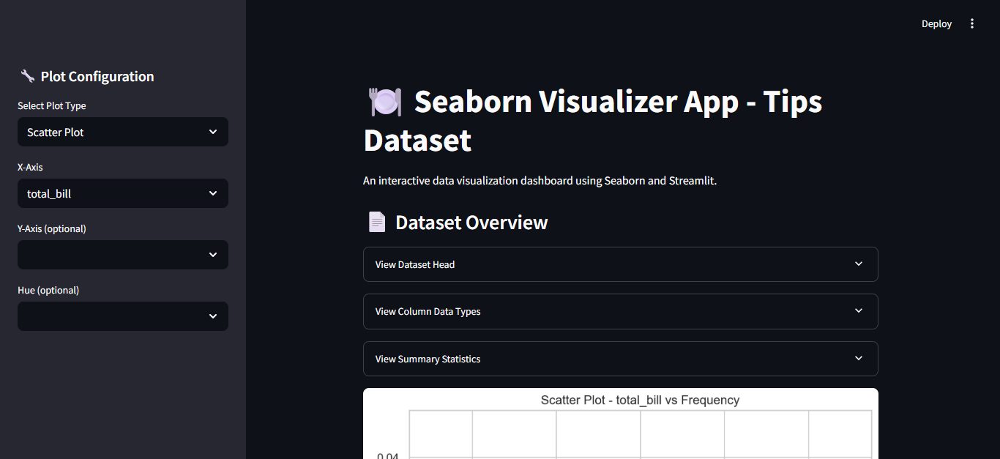
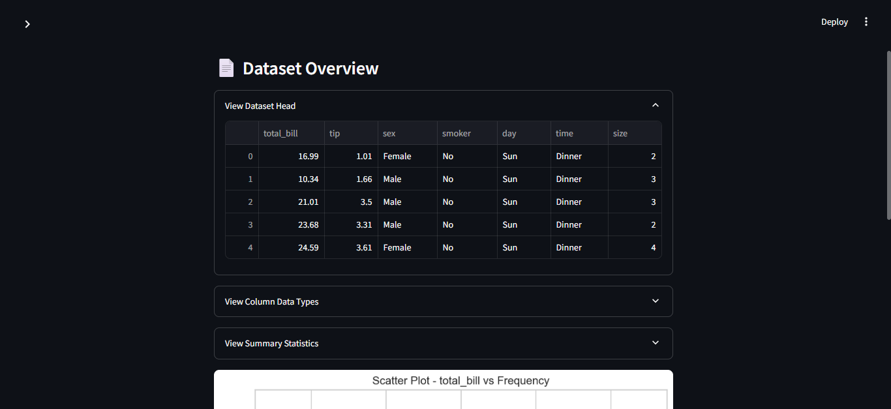
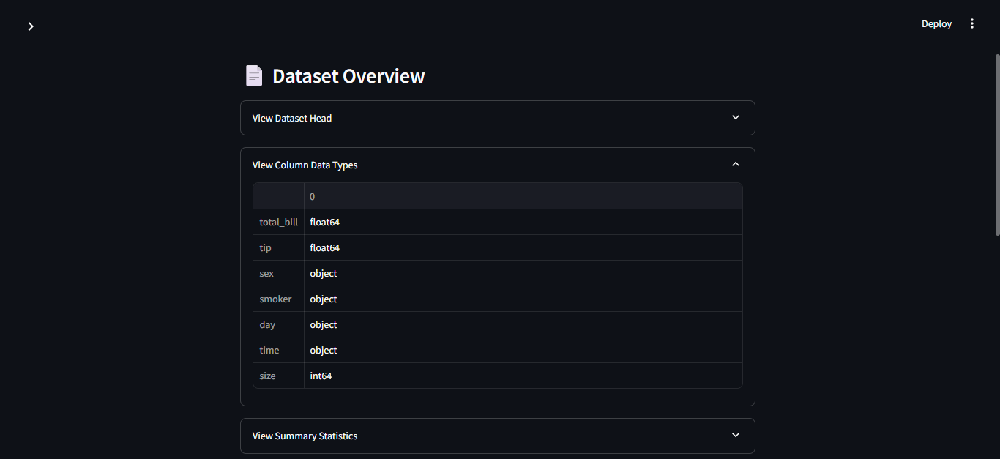
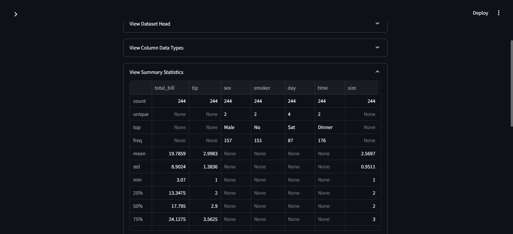
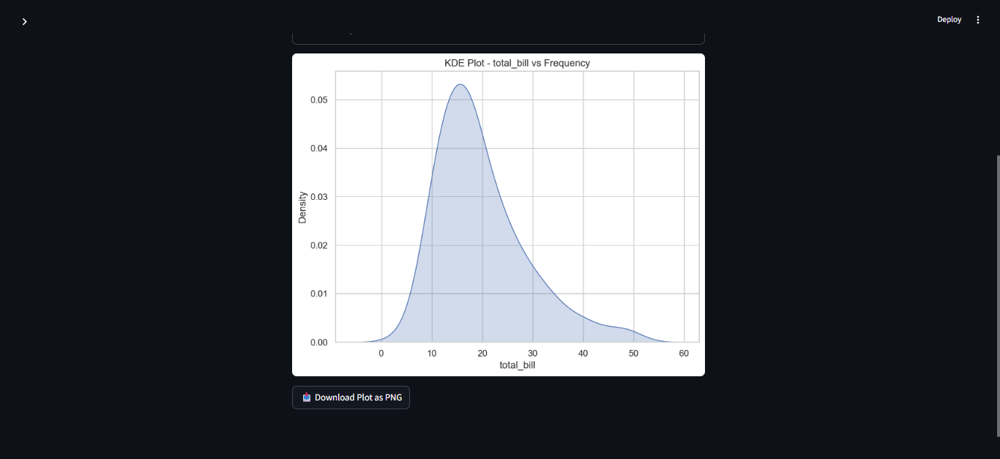

# 🍽️  Predictive-Model-Visualizer-using-Streamlit

An interactive data visualization dashboard built with **Seaborn** and **Streamlit** that allows users to explore the classic `tips` dataset through dynamic plot selection and customization.

---

## 📊 Features

✅ View dataset head, column data types, and summary statistics  
✅ Choose from multiple Seaborn plot types:
- Scatter Plot
- Line Plot
- Bar Plot
- Box Plot
- Violin Plot
- Histogram
- KDE Plot
- Count Plot
- Strip Plot
- Regression Plot

✅ Customize plots with:
- X-axis and Y-axis
- Hue (grouping variable)

✅ Download the generated plot as a PNG file

---

## 📁 Project Structure

```
Predictive-Model-Visualizer-using-Streamlit/
│
├── app.py                  # Main Streamlit app
├── tips_dataset.csv        # Dataset used in the app
├── output/                 # Screenshots of the app
│   ├── Output_1.png
│   ├── Output_2.png
│   ├── Output3.png
│   ├── Output_4.png
│   ├── Output_5.png
│   └── Output_6.png
└── README.md               # Project documentation
```

---

## 🧾 About the Dataset

The `tips` dataset is a built-in dataset in Seaborn that contains information about tips received by waiters in a restaurant. It includes features such as:

- `total_bill`: Total bill (cost of the meal)
- `tip`: Tip given
- `sex`: Gender of the person paying the bill
- `smoker`: Whether the person is a smoker
- `day`: Day of the week
- `time`: Lunch or Dinner
- `size`: Size of the dining party

---

## 🚀 How to Run This Project

### 🔧 Requirements

Install the necessary libraries:

```bash
pip install streamlit pandas seaborn matplotlib
```

### ▶️ Start the App

```bash
streamlit run app.py
```

---

## 🖼️ Screenshots

| Dashboard Overview | Plot Configuration |
|--------------------|--------------------|
|  |  |

| Column Data Types | Summary Statistics |
|-------------------|--------------------|
|  |  |

| KDE Plot | Dataset Head |
|----------|--------------|
|  |  |

---

## 💡 Use Cases

This app is ideal for:
- Quickly exploring datasets visually
- Creating downloadable charts for presentations or reports

---


## 🧠 Author

**Chris Mahlake**  
*Python | Seaborn - Matplotlib | Streamlit Enthusiast*

[LinkedIn Profile](https://www.linkedin.com/in/mahlakechris93/)

---


## 🙏 Acknowledgements

- [Seaborn](https://seaborn.pydata.org/)
- [Streamlit](https://streamlit.io/)
- [Matplotlib](https://matplotlib.org/)
